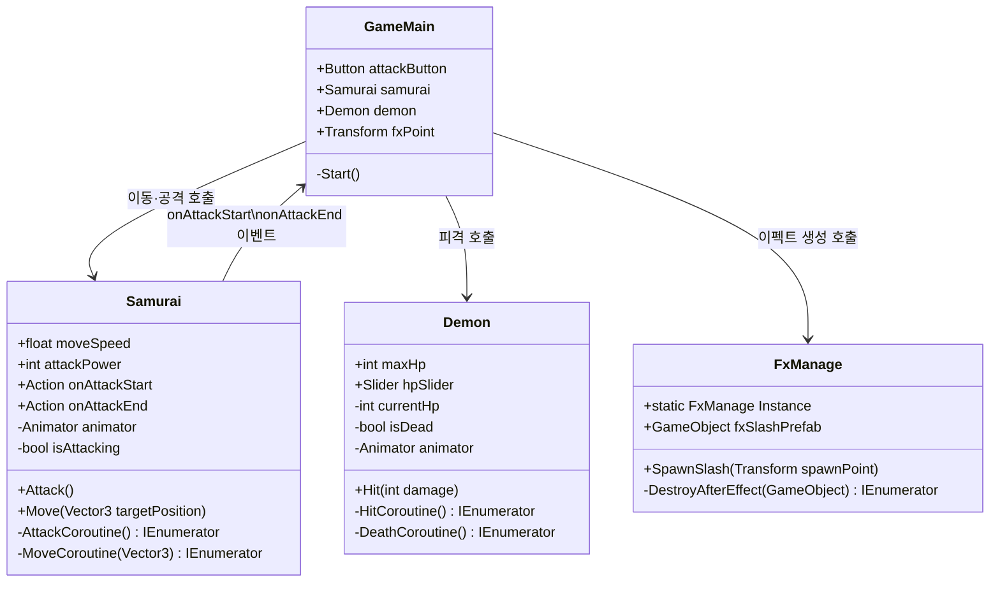
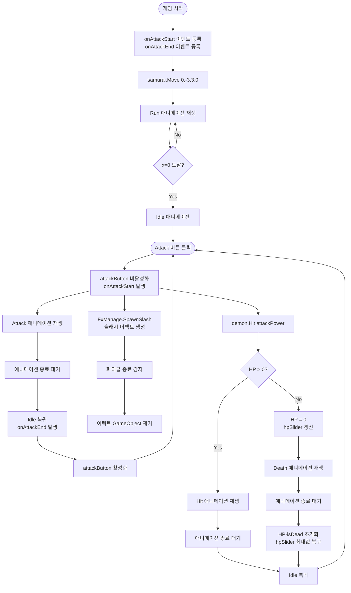
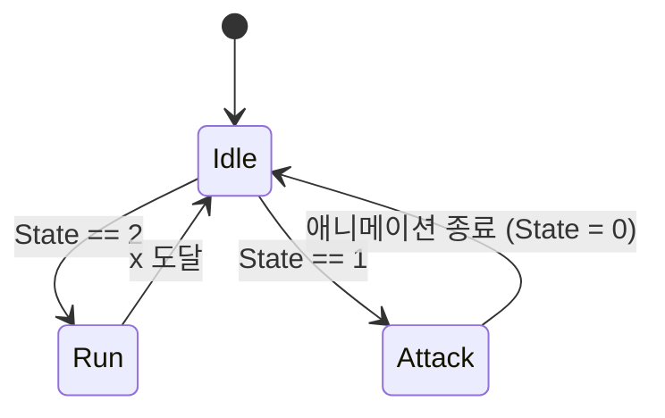
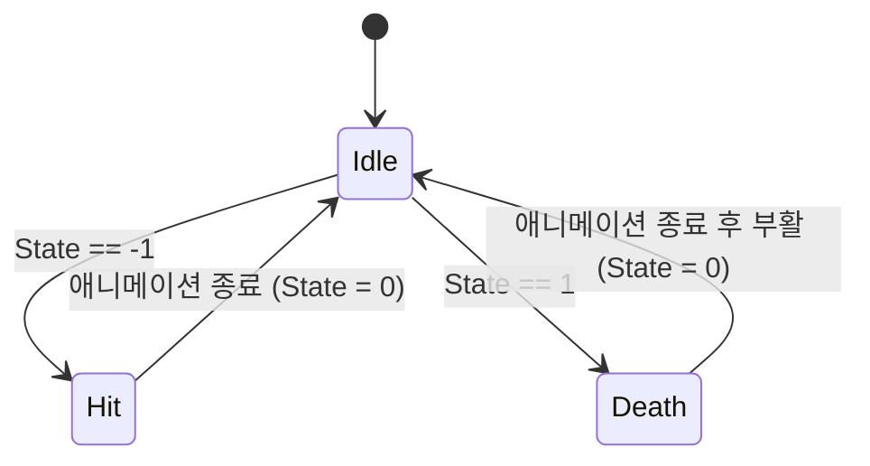

# ⚔️ Samurai 2D

Unity 2D 픽셀아트 사무라이 프로젝트입니다.  
**이펙트 적용**, **애니메이션 제어**, **AI(Cursor)를 게임 개발에 활용하는 방법**을 학습하기 위해 제작되었습니다.

---

## 🎮 게임 개요

| 항목 | 내용 |
|------|------|
| 장르 | 2D 픽셀아트 액션 |
| 시점 | 횡스크롤 |
| 핵심 기능 | 사무라이 이동 → 공격 → 데몬 피격/사망 → 부활 반복 |

### 플레이 흐름

```
게임 시작
  └─► 사무라이가 오른쪽에서 x=0 위치로 달려옴 (Run 애니메이션)
        └─► 도착 후 대기 (Idle 애니메이션)
              └─► [Attack 버튼 클릭]
                    ├─► 사무라이 공격 애니메이션 재생
                    ├─► 슬래시 이펙트 생성 (칼끝 위치)
                    ├─► 데몬 HP 5 감소 + HP 슬라이더 갱신
                    ├─► 데몬 피격 애니메이션 재생
                    └─► HP가 0 이하면 사망 애니메이션 → 부활 반복
```

---

## 🛠 개발 환경

| 항목 | 버전 |
|------|------|
| Unity | 2022.3 LTS 이상 |
| Render Pipeline | URP (Universal Render Pipeline) 2D |
| 언어 | C# |
| IDE | Cursor / Visual Studio |
| 플랫폼 | PC / Android |

---

## 📁 프로젝트 구조

```
Assets/
├── Animitor/                        # Animator Controller & 애니메이션 클립
│   ├── IDLE_0.controller            # 사무라이 Animator Controller
│   ├── Samurai.anim                 # Idle 애니메이션
│   ├── SamuraiAttack.anim           # 공격 애니메이션
│   ├── SamuraiRun.anim              # 이동 애니메이션
│   └── Demon/
│       ├── Demon.controller         # 데몬 Animator Controller
│       ├── Demon_idle.anim          # 데몬 Idle 애니메이션
│       ├── Demon_Hit.anim           # 데몬 피격 애니메이션
│       └── Deemon_Death.anim        # 데몬 사망 애니메이션
├── BackGround/
│   └── Background.png               # 배경 이미지
├── Demon/                           # 데몬 스프라이트 시트
│   ├── 01_demon_idle/               # Idle 프레임 (6장)
│   ├── 03_demon_cleave/             # 공격 프레임 (15장)
│   ├── 04_demon_take_hit/           # 피격 프레임 (5장)
│   └── 05_demon_death/              # 사망 프레임 (22장)
├── Prefabs/
│   ├── Samurai.prefab               # 사무라이 프리팹
│   ├── Demon.prefab                 # 데몬 프리팹
│   └── fxSlashPrefab.prefab         # 슬래시 VFX 프리팹
├── Samurai/                         # 사무라이 스프라이트 시트
│   └── FREE_Samurai 2D Pixel Art v1.2/
├── Scene/                           # 스크립트
│   ├── Samurai.cs
│   ├── Demon.cs
│   ├── GameMain.cs
│   └── FxManage.cs
├── Scenes/
│   └── GameScene.unity              # 메인 씬
├── Layer Lab/                       # UI 에셋 (HP 슬라이더)
├── pont/                            # 한글 폰트 (Mona12TextKR)
└── Settings/                        # URP 렌더러 설정
```

---

## 🏗 스크립트 아키텍처



---

## 🔄 게임 흐름 다이어그램



---

## 🎬 Animator 상태 머신

### 사무라이 (IDLE_0.controller)



| State 값 | 상태 | 설명 |
|----------|------|------|
| `0` | Idle | 대기 |
| `1` | Attack | 공격 |
| `2` | Run | 이동 |

> ⚠️ `SamuraiAttack.anim`의 **Loop Time을 OFF** 해야 공격 종료 감지가 정상 동작합니다.

---

### 데몬 (Demon.controller)



| State 값 | 상태 | 설명 |
|----------|------|------|
| `0` | Idle | 대기 |
| `-1` | Hit | 피격 |
| `1` | Death | 사망 → 부활 |

---

## 📜 스크립트 상세

### `Samurai.cs` — 캐릭터 제어

사무라이의 **이동**, **공격**, **애니메이션 전환**, **이벤트 발행**을 담당합니다.

#### Inspector 필드

| 필드 | 타입 | 기본값 | 설명 |
|------|------|--------|------|
| `moveSpeed` | float | 3 | 이동 속도 |
| `attackPower` | int | 5 | 공격력 (데몬에게 전달) |
| `fxPoint` | Transform | - | 슬래시 이펙트 생성 위치 |

#### 이벤트

| 이벤트 | 발생 시점 |
|--------|-----------|
| `onAttackStart` | 공격 애니메이션 시작 직후 |
| `onAttackEnd` | 공격 애니메이션 완전 종료 후 Idle 복귀 시 |

#### 핵심 메서드

```csharp
// 목적지 x=0 으로 Run 애니메이션으로 이동 후 Idle 복귀
public void Move(Vector3 targetPosition)

// 공격 1회 실행. 중복 호출 방지(isAttacking 플래그)
public void Attack()
```

---

### `Demon.cs` — 몬스터 제어

데몬의 **HP 관리**, **피격/사망 애니메이션**, **HP 슬라이더 연동**을 담당합니다.

#### Inspector 필드

| 필드 | 타입 | 기본값 | 설명 |
|------|------|--------|------|
| `maxHp` | int | 100 | 최대 HP |
| `hpSlider` | Slider | - | HP UI 슬라이더 연결 |

#### 피격 처리 흐름

```
Hit(damage) 호출
  ├─ isDead == true → 즉시 return (무적 상태)
  ├─ currentHp -= damage
  ├─ hpSlider.value 갱신
  ├─ HP > 0  → HitCoroutine  (Hit 애니메이션 → Idle)
  └─ HP <= 0 → DeathCoroutine (Death 애니메이션 → 부활 → Idle)
```

---

### `FxManage.cs` — 이펙트 싱글톤 매니저

게임 내 모든 VFX 생성을 책임지는 **싱글톤** 클래스입니다.

#### 싱글톤 동작 원리

```
Awake()
  ├─ Instance가 이미 존재 → 자신(this)을 Destroy
  └─ Instance가 없음     → Instance = this 로 등록
```

#### Inspector 필드

| 필드 | 타입 | 설명 |
|------|------|------|
| `fxSlashPrefab` | GameObject | 슬래시 이펙트 프리팹 |

#### 이펙트 생성 및 제거

```
SpawnSlash(spawnPoint) 호출
  → 프리팹의 rotation·scale 유지하며 Instantiate
  → DestroyAfterEffect 코루틴 시작
      → ParticleSystem.IsAlive(true) 감시 (자식 포함)
      → 모든 파티클 소멸 후 GameObject 제거
```

---

### `GameMain.cs` — 게임 흐름 제어

게임 시작 시 초기화 및 버튼 이벤트를 관리합니다.

#### Inspector 필드

| 필드 | 타입 | 설명 |
|------|------|------|
| `attackButton` | Button | 공격 버튼 UI |
| `samurai` | Samurai | 사무라이 오브젝트 |
| `demon` | Demon | 데몬 오브젝트 |
| `fxPoint` | Transform | 슬래시 이펙트 생성 위치 |

#### 버튼 상태 제어

- `onAttackStart` 구독 → `attackButton.interactable = false` (공격 중 중복 클릭 방지)
- `onAttackEnd` 구독 → `attackButton.interactable = true` (공격 종료 후 재활성화)

---

## 🔧 Unity Inspector 설정 가이드

### GameMain 오브젝트

| 슬롯 | 연결 대상 |
|------|-----------|
| Attack Button | Canvas 하위 공격 버튼 오브젝트 |
| Samurai | Hierarchy의 Samurai 오브젝트 |
| Demon | Hierarchy의 Demon 오브젝트 |
| Fx Point | 칼끝 위치 빈 오브젝트 (Transform) |

### Samurai 오브젝트

| 슬롯 | 연결 대상 |
|------|-----------|
| Fx Point | Samurai 하위 빈 오브젝트 (칼끝 위치) |

> Samurai 하위에 `Create Empty`로 빈 오브젝트를 만들고 칼끝에 배치 후 연결합니다.

### Demon 오브젝트

| 슬롯 | 연결 대상 |
|------|-----------|
| Hp Slider | Canvas의 `Slider_Border_EdgeDeco_01_Demo` |

### FxManage 오브젝트

| 슬롯 | 연결 대상 |
|------|-----------|
| Fx Slash Prefab | `Assets/Prefabs/fxSlashPrefab.prefab` |

---

## 🎨 사용된 에셋

| 에셋 | 용도 |
|------|------|
| FREE Samurai 2D Pixel Art v1.2 | 사무라이 스프라이트 (Idle / Run / Attack / Hurt) |
| Demon 스프라이트 | 데몬 스프라이트 (Idle / Hit / Death / Cleave) |
| NamuFX - Simple Stylized Slash | 슬래시 VFX 파티클 |
| Free Pixel Art Forest | 배경 이미지 |
| Sword Combat Sound Effects Free | 검 효과음 |
| GUI Pro - FantasyRPG (Layer Lab) | HP 슬라이더 UI |
| Mona12TextKR | 한글 폰트 |

---

## 📚 학습 포인트

### 코루틴 (Coroutine)

- `IEnumerator` + `StartCoroutine`으로 비동기 흐름 제어
- `yield return null` : 매 프레임 진행
- `GetCurrentAnimatorStateInfo(0).length` : 현재 애니메이션 길이 동적 획득
- `WaitUntil(() => !ps.IsAlive(true))` : 파티클 종료 감지

### 싱글톤 패턴 (Singleton)

- `static Instance` 프로퍼티로 전역 접근
- `Awake()`에서 중복 인스턴스 제거 보장

### C# 이벤트 / 콜백

- `public Action onAttackStart` : 느슨한 결합(Loose Coupling) 구현
- 구독(`+=`) / 발행(`?.Invoke()`) 패턴
- 버튼 활성/비활성을 외부(GameMain)에서 주도하지 않고 이벤트로 수신

### Awake vs Start 실행 순서

- `Animator` 초기화를 `Awake()`에서 처리 → 다른 오브젝트의 `Start()`에서 안전하게 참조 가능
- `GameMain.Start()` → `Samurai.Move()` 호출 시 `animator`가 이미 초기화된 상태 보장

### Animator 파라미터 제어

- `Animator.StringToHash("State")` : 문자열 대신 해시값으로 성능 최적화
- `SetInteger` : int 타입 파라미터로 상태 전환
- 음수 값(-1)도 파라미터로 활용 가능

---

## 👤 개발자

- **jyunsu05** — [GitHub](https://github.com/jyunsu05)
